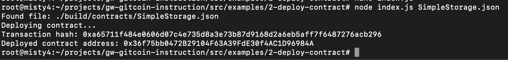

## 1. A screenshot of the console output immediately after you have successfully deployed a smart contract.

## 2. The transaction hash from the contract deployment (in text format).
0xa65711f484e0606d07c4e735d8a3e73b87d9168d2a6eb5aff7f6487276acb296
## 3. The deployed contract address from the contract deployment (in text format).
0x36f75bb0472B29104F63A39FdE30f4AC1D96984A
