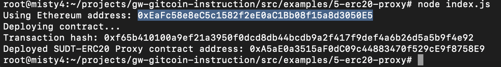
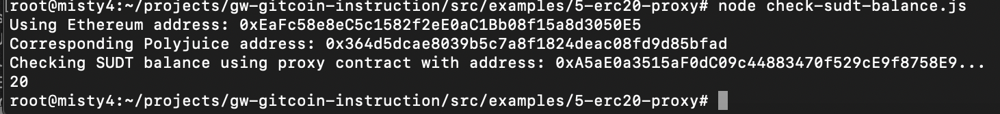

## 1. A screenshot of the console output immediately after deploying smart contract.

## 2. The address of the ERC20 Proxy Contract you deployed (in text format).
0xA5aE0a3515aF0dC09c44883470f529cE9f8758E9
## 3. A screenshot of the console output immediately after checking your SUDT balance.

## 4. The Ethereum address that was checked (in text format).
0xEaFc58e8eC5c1582f2eE0aC1Bb08f15a8d3050E5
