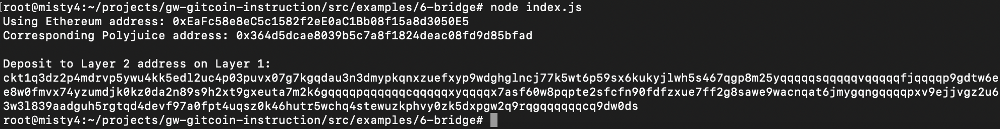

## 1. A screenshot of the console output immediately after you have successfully generated your Deposit Receiver Address.

## 2. Your Deposit Receiver Address (in text format).
ckt1q3dz2p4mdrvp5ywu4kk5edl2uc4p03puvx07g7kgqdau3n3dmypkqnxzuefxyp9wdghglncj77k5wt6p59sx6kukyjlwh5s467qgp8m25yqqqqqsqqqqqvqqqqqfjqqqqp9gdtw6ee8w0fmvx74yzumdjk0kz0da2n89s9h2xt9gxeuta7m2k6gqqqqpqqqqqqcqqqqqxyqqqqx7asf60w8pqpte2sfcfn90fdfzxue7ff2g8sawe9wacnqat6jmygqngqqqqpxv9ejjvgz2u63w3l839aadguh5rgtqd4devf97a0fpt4uqsz0k46hutr5wchq4stewuzkphvy0zk5dxpgw2q9rqgqqqqqqcq9dw0ds
## 3. The Ethereum address used to generate the Deposit Receiver Address (in text format).
0xEaFc58e8eC5c1582f2eE0aC1Bb08f15a8d3050E5
## 4. A link to the Etherscan explorer for the successful Force Bridge transaction. This can be found on Force Bridge under History→Succeed.
[https://rinkeby.etherscan.io/tx/0x23324459d58ba382d72ba84dee872adaa5b171ec35508e1c93f6b9b2c2ec816f](https://rinkeby.etherscan.io/tx/0x23324459d58ba382d72ba84dee872adaa5b171ec35508e1c93f6b9b2c2ec816f)
## 5. A link to the Nervos explorer for the successful Force bridge transaction. This can be found on Force Bridge under History→Succeed.
[https://explorer.nervos.org/aggron/transaction/0xd0b63ea64a35817cf15c197596487b49074bf2566ee6362f50860897f618f526](https://explorer.nervos.org/aggron/transaction/0xd0b63ea64a35817cf15c197596487b49074bf2566ee6362f50860897f618f526)
